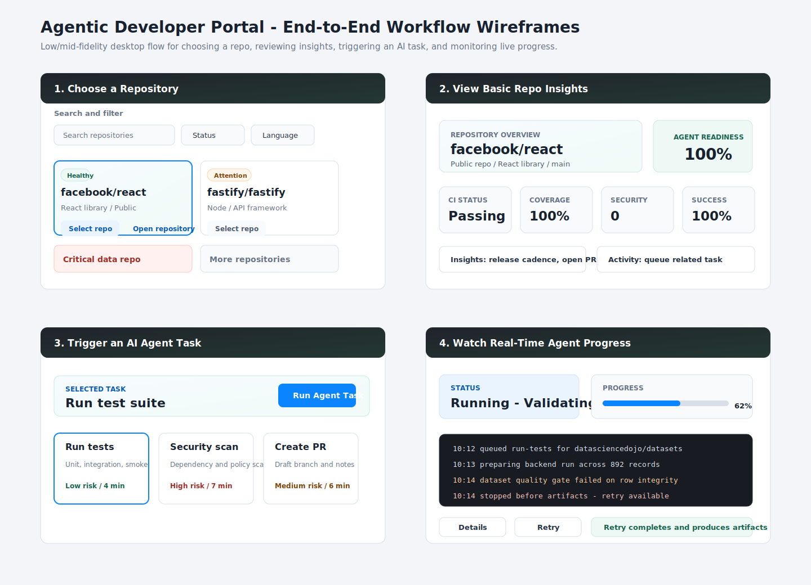
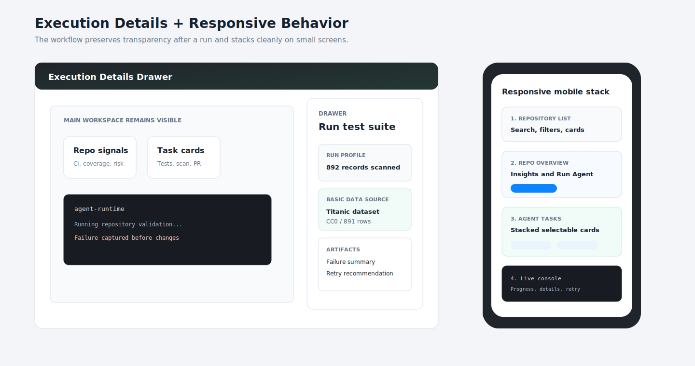

# Wireframes

These low/mid-fidelity wireframes illustrate the complete developer workflow requested in the take-home exercise:

1. Choose a repository.
2. View basic insights about that repository.
3. Trigger an AI Agent task.
4. Watch the agent progress update in real time.

## Desktop Workflow



This wireframe shows the primary desktop experience as a three-pane developer console:

- Left: repository search, filtering, selection, and a separate open-repository action.
- Center: repository identity, metadata, health metrics, insights, activity, and task selection.
- Right: live agent execution status, progress, streaming logs, retry, and details.

## Execution Details And Responsive Behavior



This wireframe shows how the experience remains transparent after an agent run:

- The main workspace stays visible.
- The details drawer exposes run metadata, artifacts, timeline, and dataset source information.
- On mobile, the three-pane console becomes a stacked workflow so the same capabilities remain accessible without horizontal scrolling.

## Screen Flow

```text
Choose repo -> Review repo insights -> Select agent task -> Run agent -> Watch logs
                                      -> Failure state -> Retry -> Completed artifacts
```

## Key Interaction Notes

- Repository cards are clickable for selection only.
- The separate `Open repository` action opens repository details.
- The repository detail window footer includes `Close` and `Open direct repository`.
- The primary `Run Agent Task` button appears once at the top of the selected repository context.
- Recent activity items can queue a related task.
- The execution panel uses visible states: idle, pending, running, success, and failure.
- Running the agent simulates the full project workflow: fork, dependency review, scan, tests, refactor, upgrade, and PR request.
- Agent action timing starts at `0 min`, updates live for the running task, and preserves only the completed or failed task duration.
- A failed first attempt on the basic data repository demonstrates retry and recovery.
